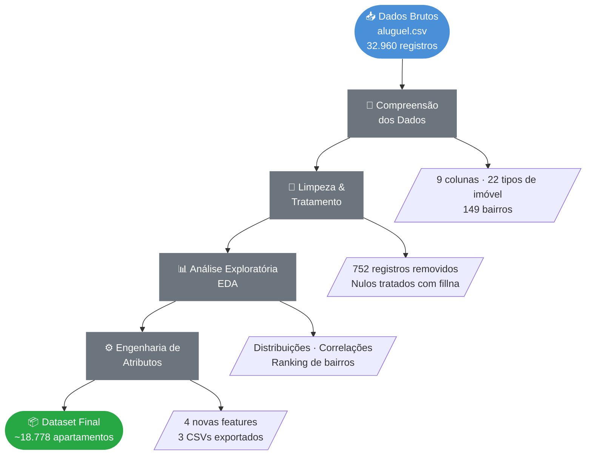

<div align="center">

# 🏠 Análise de Dados Imobiliários
### EDA · Limpeza · Engenharia de Atributos · Preparação para ML

<br>

[](https://www.python.org/)
[](https://pandas.pydata.org/)
[](https://jupyter.org/)
[](https://colab.research.google.com/)
[]()
[](LICENSE)

<br>

> Projeto de Ciência de Dados focado na análise, limpeza e preparação de dados de imóveis para aluguel,
> gerando insights estratégicos e um dataset pronto para modelos de Machine Learning.

</div>

---

## 📋 Índice

- [Contexto](#-contexto)
- [Objetivos](#-objetivos)
- [Pipeline do Projeto](#-pipeline-do-projeto)
- [Tecnologias](#-tecnologias-utilizadas)
- [Dataset](#-dataset)
- [Etapas Detalhadas](#-etapas-detalhadas)
- [Principais Resultados](#-principais-resultados)
- [Estrutura do Repositório](#-estrutura-do-repositório)
- [Como Executar](#-como-executar)
- [Autor](#-autor)

---

## 🏢 Contexto

Este é um projeto educacional desenvolvido para simular um cenário real de mercado: uma **imobiliária fictícia** que deseja aprimorar sua plataforma digital com o apoio de **Machine Learning**.

Atuei como **Cientista de Dados** responsável por atender às demandas de dois times:

| Time | Demanda |
|------|---------|
| 🛠️ **Devs** | Dataset limpo e padronizado para integração no site |
| 🤖 **ML** | Variáveis relevantes e bem tratadas para modelagem preditiva |

---

## 🎯 Objetivos

- 🔍 Compreender e explorar os dados brutos de imóveis para aluguel
- 🧹 Tratar inconsistências, valores ausentes e outliers
- ⚙️ Criar variáveis derivadas úteis para modelos preditivos
- 📦 Exportar um dataset final limpo e documentado
- 💡 Gerar insights sobre os fatores que impactam o preço dos imóveis

---

## 🔄 Pipeline do Projeto



---

## 🛠️ Tecnologias Utilizadas

<div align="center">

| Tecnologia | Uso no Projeto |
|---|---|
|  | Linguagem principal |
|  | Manipulação e análise dos dados |
|  | Operações numéricas |
|  | Visualizações e gráficos |
|  | Ambiente de desenvolvimento |

</div>

---

## 📂 Dataset

**Fonte:** `aluguel.csv` — repositório público da [Alura](https://github.com/alura-cursos/pandas-conhecendo-a-biblioteca)
**Uso:** Exclusivamente educacional

| Característica | Detalhe |
|---|---|
| 📋 Tipo | Dados de imóveis para aluguel |
| 📏 Volume bruto | 32.960 linhas · 9 colunas |
| 🏷️ Variáveis | Tipo, Bairro, Quartos, Vagas, Suítes, Área, Valor, Condomínio, IPTU |
| 🗺️ Cobertura geográfica | 149 bairros |
| 🏘️ Tipos de imóvel | 22 categorias |

---

## 📝 Etapas Detalhadas

<details>
<summary><b>1️⃣ Importação e Compreensão dos Dados</b></summary>

- Leitura do dataset com `pandas.read_csv()` via URL pública
- Análise do shape, tipos de dados e estatísticas descritivas
- Identificação de variáveis quantitativas (`int64`, `float64`) e qualitativas (`object`)
- Mapeamento de valores nulos por coluna:

| Coluna | Nulos | % do total |
|---|---|---|
| Valor | 17 | 0,05% |
| Condomínio | 4.093 | 12,4% |
| IPTU | 10.237 | 31,1% |

</details>

<details>
<summary><b>2️⃣ Limpeza e Tratamento</b></summary>

- Remoção de **14 categorias comerciais** (Conjunto Comercial, Prédio Inteiro, Loja/Salão, etc.)
- Filtragem para foco em **apartamentos residenciais**
- Preenchimento de nulos com `fillna(0)`
- Remoção de **752 registros** com Valor = 0 ou Condomínio = 0
- Drop da coluna `Tipo` após filtragem (redundante)

</details>

<details>
<summary><b>3️⃣ Análise Exploratória de Dados (EDA)</b></summary>

- Distribuição dos imóveis por tipo e percentual na base
- Ranking de bairros por valor médio de aluguel
- Média de quartos: **2,48 por apartamento**
- Gráficos de barras horizontais para comparação de preços entre categorias

</details>

<details>
<summary><b>4️⃣ Engenharia de Atributos</b></summary>

| Feature criada | Lógica |
|---|---|
| `Valor_por_mes` | `Condomínio + Valor` |
| `Valor_por_ano` | `Valor_por_mes × 12 + IPTU` |
| `Descricao` | Texto concatenado: tipo + bairro + quartos + suítes |
| `Possui_suite` | Flag binária via `.apply()`: `"Sim"` / `"Não"` |

</details>

---

## 📊 Principais Resultados

### Distribuição dos Tipos de Imóvel


> **Apartamentos dominam com 84,5% da base**, seguidos por Casa de Condomínio (4,3%) e Casa (4,2%). Essa concentração valida o foco exclusivo em apartamentos para a modelagem.

---

### Valor Médio por Tipo de Imóvel — Todos os Tipos


> Visão panorâmica do mercado. Imóveis comerciais (Indústria, Hotel, Galpão) distorcem a escala — o que motivou a separação entre residencial e comercial na análise.

---

### Valor Médio por Tipo de Imóvel — Apenas Residenciais


| Tipo | Aluguel Médio |
|---|---|
| Quitinete | R$ 1.247 |
| Casa de Vila | R$ 1.574 |
| Loft | R$ 2.558 |
| Flat | R$ 4.546 |
| **Apartamento** | **R$ 4.745** |
| Casa | R$ 6.793 |
| Casa de Condomínio | R$ 11.952 |

---

### 🏆 Top 5 Bairros — Maior Valor Médio (Apartamentos)


| Ranking | Bairro | Aluguel Médio |
|---|---|---|
| 🥇 | Joá | R$ 15.500 |
| 🥈 | Arpoador | R$ 12.430 |
| 🥉 | Cidade Jardim | R$ 12.000 |
| 4º | Ipanema | R$ 9.487 |
| 5º | Botafogo | R$ 9.369 |

> A diferença entre o bairro mais caro (Joá — R$ 15.500) e o mais barato (Ricardo de Albuquerque — R$ 340) é de **~45x**, evidenciando a forte segmentação geográfica do mercado.

---

### 📦 Datasets Exportados

| Arquivo | Registros | Critério de Filtro |
|---|---|---|
| `dados_apartamentos.csv` | ~18.778 | Todos os apartamentos limpos |
| `filtro_1.csv` | 495 | 1 quarto + aluguel < R$ 1.200 |
| `filtro_2.csv` | 4.456 | ≥ 2 quartos + aluguel < R$ 3.000 + área > 70m² |

### 🚀 Próximos Passos Sugeridos

- [ ] Modelo de **regressão** para prever preço de aluguel
- [ ] Classificador de imóveis de **alto padrão** (acima do percentil 75)
- [ ] Dashboard interativo com **Streamlit** ou **Power BI**
- [ ] Análise de **sazonalidade** com dados temporais

---

## 📁 Estrutura do Repositório

```
Projeto-Imobiliaria/
│
├── 📁 assets/                          # Gráficos gerados na análise
│   ├── Distribuição Percentual por Tipo de Imóvel.png
│   ├── Top 5 Bairros com Maior Valor Médio Apartamentos.png
│   ├── Valor Médio por Tipo de Imóvel Residencial.png
│   └── Valor Médio por Tipo de Imóvel todos os tipos.png
│
├── 📓 Projeto_imobiliaria/
│   └── Projeto__imobiliaria.ipynb      # Notebook completo com análise e tratamento
│
└── 📄 README.md                        # Documentação do projeto
```

> **Dados:** O arquivo `aluguel.csv` não está versionado por ser uma fonte pública externa.
> Acesse via: [Repositório da Alura](https://github.com/alura-cursos/pandas-conhecendo-a-biblioteca)

---

## ▶️ Como Executar

### Opção 1 — Google Colab (Recomendado) ☁️

1. Clique no badge abaixo para abrir direto no Colab:

   [](https://colab.research.google.com/github/Anderson1999DC/Projeto-Imobiliaria/blob/main/Projeto_imobiliaria/Projeto__imobiliaria.ipynb)

2. Execute todas as células (`Ctrl + F9`) — o dataset é carregado automaticamente via URL pública

### Opção 2 — Local 🖥️

**Pré-requisitos:** Python 3.10+ e pip

```bash
# 1. Clone o repositório
git clone https://github.com/Anderson1999DC/Projeto-Imobiliaria.git
cd Projeto-Imobiliaria

# 2. Instale as dependências
pip install pandas numpy matplotlib seaborn jupyter

# 3. Inicie o Jupyter Notebook
jupyter notebook Projeto_imobiliaria/Projeto__imobiliaria.ipynb
```

---

## 👨‍💻 Autor

<div align="center">


**Anderson Junior**
*Cientista de Dados*

[](https://www.linkedin.com/in/anderson-coelho-42671634a/)
[](https://github.com/Anderson1999DC)

</div>

---

<div align="center">

*Feito com ❤️ e muitos dados por Anderson Junior*

</div>
